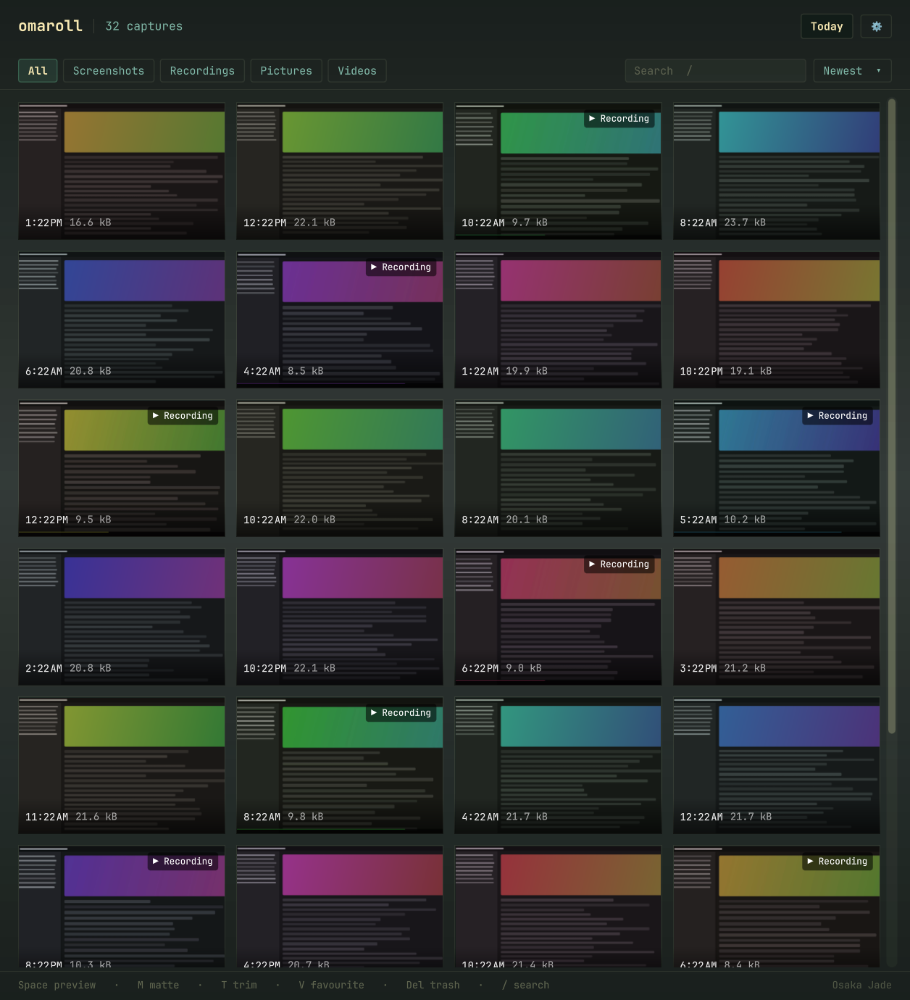
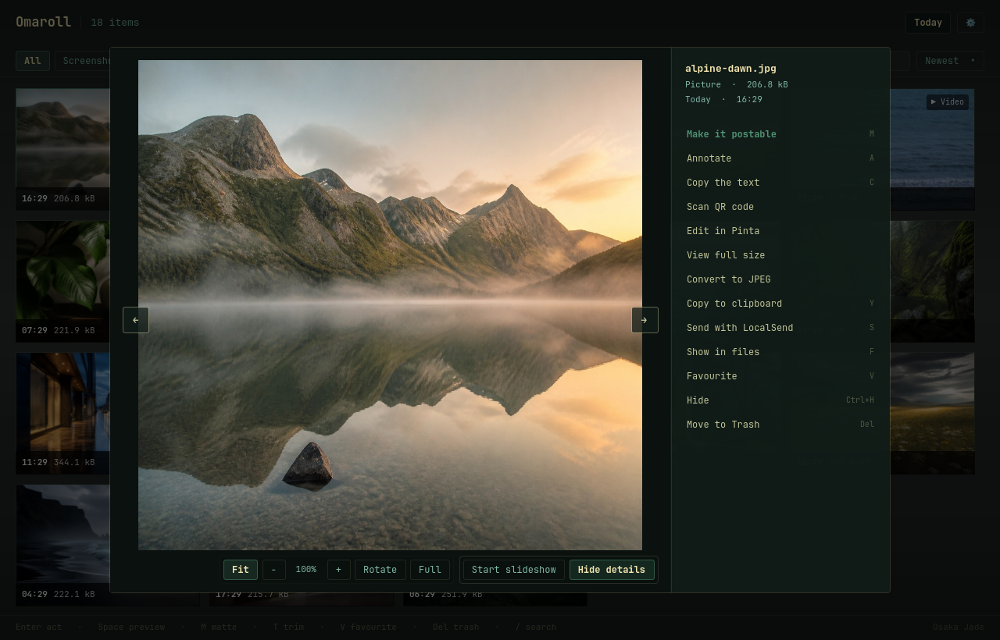
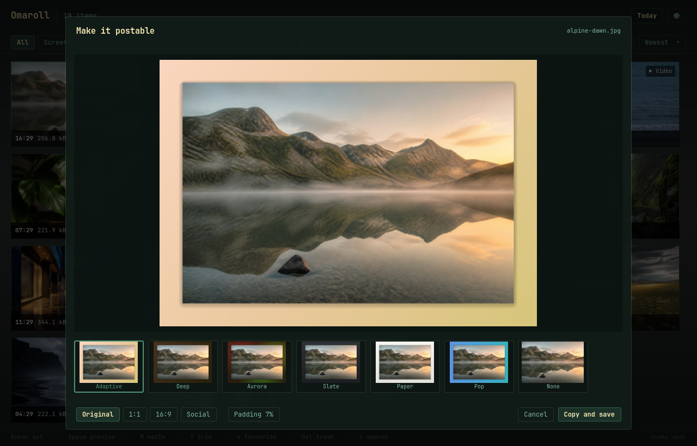

<p align="center">
  
</p>

# Omaroll

**Your media, in one beautiful library.**

A fast, beautiful image, video, and PDF viewer that turns your media folders into a
library. Open one file and move through the rest of its folder, open a selection
of files in order, or browse photos,
videos, documents, downloads, albums, tags, and custom folders together.

> Omaroll is an independent community project. It is not an official Omarchy
> application.

[](https://btsouth.github.io/omaroll/docs/omaroll-demo.mp4)

[Watch the 25 second demo](https://btsouth.github.io/omaroll/docs/omaroll-demo.mp4)

---

## Why

Omarchy ships an unusually good capture stack and then drops the output into a
folder. `omarchy-capture-screenshot`, `omarchy-capture-screenrecording`, omacut,
tensaku, pinta, tesseract, `omarchy-transcode` are all there and all good. What
is missing is the two steps after capture: finding the thing again, and doing
the obvious next thing with it.

```
$ ls ~/Videos
screenrecording-2026-08-30_20-10-45.mp4
screenrecording-2026-08-30_20-10-59.mp4
screenrecording-2026-08-30_20-11-49.mp4
...
```

Omaroll is the wire between the tools that make captures and the tools that act
on them.

## What it does

- **Sees everything you already have.** Screenshots, recordings, pictures,
  videos, PDFs and downloads, grouped by day, newest first. Add any other folder to
  the library from Browse or Settings, then search and switch between sources,
  folders, and albums from the library bar.
  Photos and videos use their embedded original date when available, with the
  file modification time only as a fallback. Omaroll never imports or copies
  media into its own storage. Large libraries use bounded metadata batches,
  lazy thumbnails, and worker-thread rescans.
- **Builds real albums.** Select files, add them to a named collection, and
  browse it beside your folders. Albums never move or copy media. If an album
  file is renamed or moved within the library, Omaroll repairs the entry by
  file and content identity. Files moved elsewhere and ambiguous duplicates
  stay unavailable rather than matching the wrong copy.
- **Browses time directly.** Open a month or day, jump to today or this week,
  find recently modified files, or see what changed since the previous visit.
- **Saves useful views.** Any combination of search, kind, folder, date, tag,
  favourites, hidden files, and sort order can become a smart collection that
  updates as files change.
- **Adds lightweight tags.** Tag any selection and browse it without moving or
  copying files. Tags follow in-app renames and can be combined with saved views.
- **Knows what each file is.** Omarchy stamps its captures with a predictable
  name, so a screenshot is a Screenshot even though it lives in `~/Pictures`
  next to every other image.
- **Finds words inside pictures.** Search checks filenames immediately, then
  adds matches from screenshots and photos as local Tesseract indexing
  progresses with a visible count. The private cache is reused until a file
  changes and can be cleared from Settings.
- **Reviews exact duplicates safely.** Choose Exact duplicates under Browse to
  compare same-size candidates by content. Matching sets stay together for
  review. Choose which one to keep and Omaroll moves only the other exact
  copies to Trash after confirmation.
- **Finds similar pictures.** A local perceptual comparison groups resized and
  recompressed versions for review without changing or removing anything.
- **Hands off specialist work.** Trim goes to omacut, annotate to tensaku,
  convert to `omarchy-transcode`, text to tesseract, and setting a background
  to Omarchy. Optional actions can still open mpv or imv when you want them.
- **Drags out as the real file.** Pull a thumbnail into a Discord message, a
  browser upload or a Nautilus window and the file lands there. Select several
  and they go together.
- **Previews in place.** Enter opens a capture large with every action beside
  it. Images fit, display at actual size, zoom, pan, rotate, flip, and animate.
  PDFs render in place with page navigation. Videos play with sound and include
  seeking, volume, speed, audio track, and subtitle controls. File details
  include dimensions, duration, image format, camera and exposure data when
  present, plus video codec, frame rate, bitrate and audio.
- **Presents any collection.** Start a fullscreen slideshow from a folder,
  album, search or filtered library. Images advance automatically. Videos are
  skipped by default, or can play through when enabled in Settings.
- **Acts on a selection.** Check a few tiles and send, copy, favourite, hide,
  convert, or trash them together, or Taildrop them to another of your machines.
- **Fits the tiles to you.** Ctrl and the wheel, or Ctrl with plus and minus,
  make the grid tiles bigger or smaller, and the size sticks.
- **Makes a screenshot postable.** The one thing Omaroll builds itself: six
  finished backgrounds derived from the image's own dominant colour. Pick one,
  it is on your clipboard and saved beside the original.
- **Follows your theme.** Reads the active Omarchy palette, launcher surface,
  font, corner radius and transparency, then cross-fades when you change theme.
  No restart.

## Actions

Every handler below already ships with Omarchy.

| Capture | Action | Handler |
|---|---|---|
| Recording | Trim *(default)* | `omacut` |
| Recording | Convert · resize | `omarchy-transcode` |
| Recording | Play | `mpv` |
| Recording | Save current frame | `ffmpeg`, from the viewer position |
| Screenshot | **Make it postable** *(default)* | **native** |
| Screenshot | Annotate | `$OMARCHY_SCREENSHOT_EDITOR`, default `tensaku-edit` |
| Screenshot | Extract and select text | `tesseract` |
| Image | Convert · resize | `omarchy-transcode` |
| Image | Edit · View | `pinta` · `imv` |
| Image | Set as background | `omarchy-theme-bg-set` |
| Image | Copy detected QR content | `zbarimg` |
| PDF | Open document *(default)* | `sushi` |
| Any | Rename in place | native, extension preserved |
| Image or video | Copy image | `omarchy-clipboard-paste-file` |
| Any | Send with LocalSend | `omarchy-menu-share` |
| Any | Send to a machine | `omarchy-tailscale-send`, after picking the machine |
| Any | Show in files | `nautilus` |
| Any | Move to Trash | XDG trash, never `unlink` |

The image and video defaults, including whether slideshows include videos, can
be changed in Settings.

An action whose program is missing is shown greyed with the package to install,
rather than hidden. The medium decides the list, not the folder: a downloaded
clip gets the recording actions and a downloaded photo gets the image actions.



## Mattes



Adaptive and Deep are gradients built from the capture's dominant hue, Aurora is
a soft mesh, Slate and Paper are neutrals, Pop is the complementary hue, and None
is the raw capture so the picker is never a tax. Deterministic per file: the same
screenshot always offers the same six.

The original is never touched. The composite is written as a new file beside it
and put on your clipboard.

## Keyboard

| Key | Does |
|---|---|
| arrows · `hjkl` | Move |
| `Enter` · right click | Preview with every action for that capture |
| `Space` on the grid or a still/PDF preview | Your default action for that kind, initially trim, matte, or open document |
| `Space` in a video or animated-image preview | Play · pause |
| `←` `→` in a preview | Previous · next file in the same folder |
| `J` `L` in a video preview | Seek backward · forward five seconds |
| `M` · `↑` `↓` or `9` `0` in a video preview | Mute · volume down/up |
| `[` `]` · `Backspace` in a video preview | Change speed · reset speed |
| `Home` `End` in a video preview | Start · end |
| `+` `-` · `0` · `1` · `R` in an image preview | Zoom · fit · actual size · rotate |
| `Shift+H` `Shift+V` in an image preview | Flip horizontally · vertically |
| `F11` in a preview | Enter · leave fullscreen |
| `F5` in a preview | Start · pause slideshow |
| `I` in a preview | Show · hide file info and actions |
| `M` | Make it postable |
| `T` · `P` | Trim · Play a recording |
| `G` in a video preview | Save the current frame beside the recording |
| `A` · `C` | Annotate · Extract text |
| `E` | Convert or resize, including the selection |
| `N` | Rename, preserving the extension |
| `Y` · `S` · `F` | Clipboard · Send · Show in files |
| `V` · `Ctrl+H` | Favourite · Hide |
| `1`-`8` | Jump to a section |
| `Page Up` `Page Down` in a PDF preview | Previous · next page |
| `X` · `Ctrl+A` | Select · Select all |
| with a selection | `V` `Ctrl+H` `Y` `S` `Del` act on every checked file |
| `Ctrl` + wheel · `Ctrl` `+` `-` `0` | Bigger or smaller tiles · reset |
| drag | Drop the file, or the whole selection, into another app |
| `Del` | Move to Trash, with confirm |
| `/` · `R` | Search filenames and picture text · Rescan |
| `Esc` | Clear selection, then close |

The same letters work inside the preview. "Open with Omaroll" on a picture or
video from any file manager opens it straight into its actions, with previous
and next controls for the other media in that folder. A folder handed to
`omaroll` opens as a recursive folder view for that session.

## Formats

Images: PNG, JPEG, WebP, animated GIF and WebP, BMP, AVIF, HEIC/HEIF, TIFF,
SVG/SVGZ, ICO, JXL, JPEG 2000, QOI, PSD, DDS, EXR, and TGA.
TGA support depends on the installed Qt plugin; uncompressed Truevision 2.0
files work, while older files without the footer may not.

Videos: MP4, M4V, MKV, WebM, MOV, AVI, MPEG, WMV, FLV, Ogg video, 3GP and
MTS/M2TS. Playback uses Qt's FFmpeg backend. An optional action can still hand
the file to mpv.

Documents: PDF. Thumbnails, previews, and page counts use Poppler locally.

## Install

Requires Omarchy or Arch with Qt 6.8+ and Poppler.

```bash
curl -fLO https://github.com/btsouth/omaroll/releases/download/v1.4.0/omaroll-1.4.0-1-x86_64.pkg.tar.zst \
     -fLO https://github.com/btsouth/omaroll/releases/download/v1.4.0/SHA256SUMS
sha256sum -c --ignore-missing SHA256SUMS
sudo pacman -U ./omaroll-1.4.0-1-x86_64.pkg.tar.zst
```

Run the same commands for a newer release to update. The package is prepared for
the Omarchy repository so installation and updates can move to normal `pacman`
updates after inclusion.

If you prefer a browser, download the package and `SHA256SUMS` from the
[latest release](https://github.com/btsouth/omaroll/releases/latest), put them
in the same folder, then run the last two commands above from that folder.

To build from source instead:

```bash
git clone https://github.com/btsouth/omaroll
cd omaroll
cmake -S . -B build -G Ninja -DCMAKE_BUILD_TYPE=Release
cmake --build build
sudo cmake --install build
```

## Use it as a viewer

Open any supported image, video, PDF, or folder from a terminal:

```bash
omaroll photo.jpg
omaroll ~/Pictures
```

You can also choose Omaroll from a file manager's **Open With** menu and set it
as the default for the media types you want. A single file opens directly in the
viewer, with previous and next navigation through other media in that folder.

### Transparency

Omaroll paints its own translucent chrome from your theme and draws every
thumbnail fully opaque on top. Omarchy dims all windows slightly by default,
which would wash out the pictures, so Omaroll opts out the same way mpv, imv and
Pinta do. Copy `/usr/share/omaroll/hypr/omaroll.lua` (or `packaging/hypr/omaroll.lua`
from the source tree) into `~/.config/hypr/` and require it, or add to your
Hyprland config:

```lua
o.window("^(io\\.github\\.tsouth89\\.omaroll)$", { tag = "-default-opacity" })
o.window("^(io\\.github\\.tsouth89\\.omaroll)$", { opacity = "1 1" })
```

## Try it without your own files

```bash
omaroll --demo
```

Builds a deterministic fictional library in a temp directory and browses that
instead. Nothing personal appears on screen, which is also how every screenshot
in this repository is made.

```bash
omaroll --render shot.png --render-view matte
```

Renders a view to a PNG and exits. Views include `grid`, `detail`, `video`,
`slideshow`, `matte`, `export`, `rename`, `duplicates`, and `settings`. It grabs the scene
graph rather than the screen, so an overlapping window cannot spoil the shot.

## Design notes

- **Read-only on discovery.** Browsing, indexing, duplicate review and previews
  never change media. A file changes location only when you explicitly rename
  it or move it to Trash. Generated work is written beside the original.
- **Offline.** Nothing in the core path touches the network. No telemetry, no
  sync, no accounts.
- **High DPI.** Thumbnails are generated at `devicePixelRatio` and the cache is
  keyed on the rendered pixel size, so a 1.25x or 1.5x monitor gets crisp tiles
  rather than upscaled ones.
- **Cache and state.** Thumbnails in `~/.cache/omaroll/thumbs`, bounded at 256MB
  by default, configurable from 64MB to 1GB, and pruned least-recently-used.
  Embedded media dates use a small identity-checked index in the same cache
  root, so unchanged files are not inspected again on every launch.
  Settings and organization live in `~/.config/omaroll`. Deleting that directory
  also removes albums, tags, favorites and saved views. Back it up first if you
  want to keep them. The thumbnail cache can be deleted and regenerated.

## Development

```bash
cmake -S . -B build -G Ninja
cmake --build build
ctest --test-dir build --output-on-failure
```

See [validation](tests/README.md) for the OpenGL media checks and
[the roadmap](docs/ROADMAP.md) for upcoming work.

For a focused release check on an Omarchy desktop:

1. Launch `omaroll --demo` and verify the grid, folder filters, search, sort,
   selection, and Settings at both tiled and floating window sizes.
2. Open a real image from the file manager. Verify previous and next stay in its
   folder, then test fit, actual size, deep zoom, pan, rotate, both flips,
   fullscreen, animation pause, and `F5` slideshow.
3. Open a real video. Verify play and pause, sound, volume, seeking, playback
   speed, audio tracks, subtitles, technical details, Save current frame,
   double-click fullscreen, and the transition to the next item in a slideshow.
4. Create an album, rename and move one member inside a watched folder, and
   verify it remains in the album. Move it outside the library and verify it is
   shown as unavailable instead of being matched to another file.
5. Put an exact copy of a disposable image in another watched folder. Open
   Browse, choose Exact duplicates, keep one selected copy, and verify only the
   other byte-for-byte copies move to Trash after confirmation.
6. Resize or recompress a disposable image, open Similar pictures, and verify
   the pair is grouped without either file being modified.
7. Add a tag and saved view, restart Omaroll, and verify both persist. Rename a
   tagged file inside Omaroll and verify its tag follows it.
8. Open a multipage PDF from the file manager and verify thumbnails, page
   navigation, details, rename, organize, send, and Trash actions.
9. Switch Omarchy themes while Omaroll is open and confirm the chrome updates
   without changing the media colors.
10. Move a disposable file to Trash and restore it from the desktop Trash.

## License

MIT. See [LICENSE](LICENSE).
