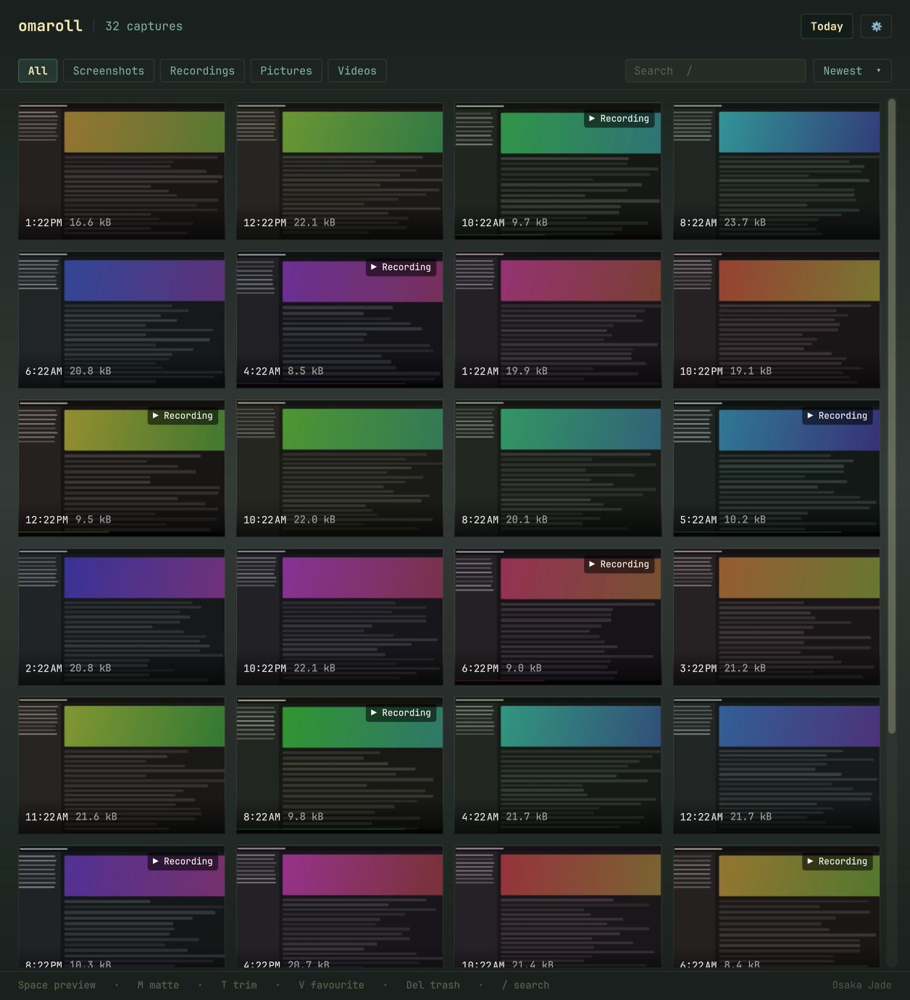
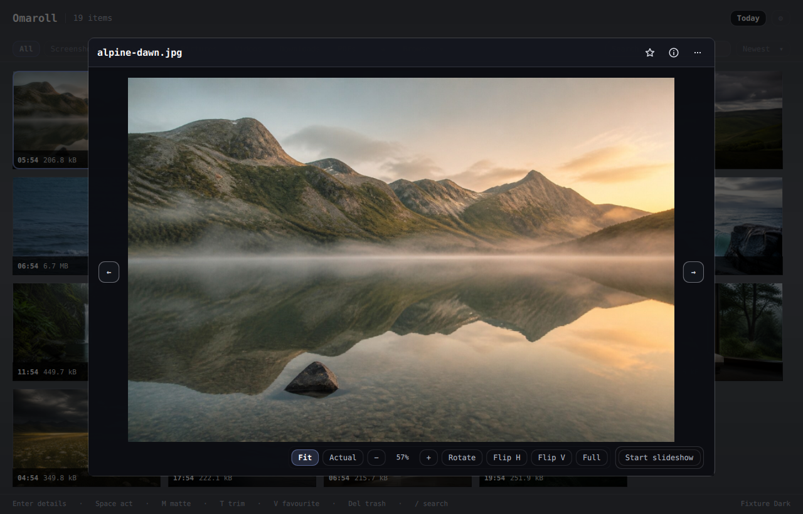
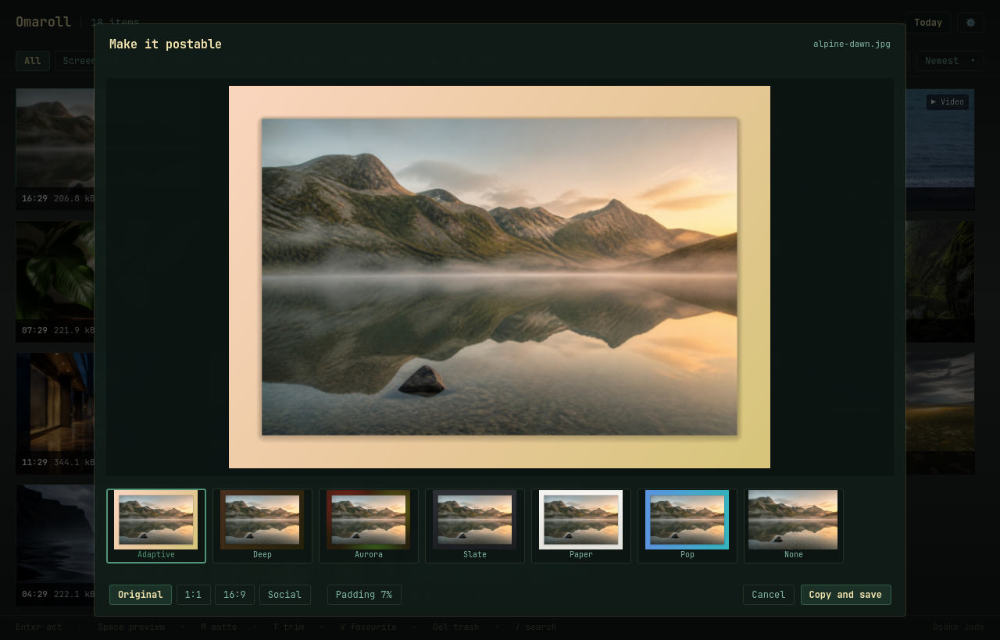

<p align="center">
  
</p>

# Omaroll

**A quick viewer and a home for your media.**

Open a picture or video in its own viewer, with the rest of its folder an arrow
key away. Open Omaroll itself to browse photos, videos, PDFs, screenshots and
recordings together, with albums, tags and search. Your files stay where they are.

Built for Omarchy. Browsing and organization work locally, without accounts or
telemetry.

> Omaroll is an independent community project, not an official Omarchy application.

[Install](#install-or-update) · [Open files](#open-files) · [Features](#features) · [Contributing](CONTRIBUTING.md)

[](https://btsouth.github.io/omaroll/docs/omaroll-demo.mp4)

[Watch the 29-second demo](https://btsouth.github.io/omaroll/docs/omaroll-demo.mp4)

## Install or update

Requires x86_64 Omarchy or Arch Linux with Qt 6.8+ and Poppler.

```bash
curl -fLO https://github.com/btsouth/omaroll/releases/download/v1.9.0/omaroll-1.9.0-1-x86_64.pkg.tar.zst \
     -fLO https://github.com/btsouth/omaroll/releases/download/v1.9.0/SHA256SUMS
sha256sum -c --ignore-missing SHA256SUMS
sudo pacman -U ./omaroll-1.9.0-1-x86_64.pkg.tar.zst
```

Run the same commands for a newer release to update. The package is prepared for
the Omarchy repository so installation and updates can move to normal `pacman`
updates after inclusion.

If you prefer a browser, download the package and `SHA256SUMS` from the
[latest release](https://github.com/btsouth/omaroll/releases/latest), put them
in the same folder, then run the last two commands above from that folder.

On another Arch Wayland desktop, install `qt6-wayland` if it is missing. For a
source build, see [Development](#development).

The release includes build provenance. To verify the package with GitHub CLI:

```bash
gh attestation verify omaroll-1.9.0-1-x86_64.pkg.tar.zst --repo btsouth/omaroll
```

## Open files

Set Omaroll as the default for pictures and videos, or open one from a
terminal:

```bash
omaroll photo.jpg
omaroll clip.mp4
```

A picture or video opens in the viewer: the media fills the window, a small
picture included, and the name, the controls and the menu appear when the
pointer moves. Rotating turns the view only; a rotated copy is saved from the
library. Pictures and videos in the folder are listed by filename. Use the arrows
to step through pictures, or Page Up and Page Down to change files while a video
is playing. Folders, PDFs and a plain `omaroll` open the library, and so does
`--library` with any file:

```bash
omaroll ~/Pictures
omaroll --library photo.jpg
```

Several files can be opened together, in the order given:

```bash
omaroll first.jpg ~/Pictures/second.png third.webp
omaroll -- ./-unusual-name.png
```

Multiple files stay in the supplied order across folders, including when an
existing window receives them. Explicitly selected hidden files can be opened
without scanning every surrounding folder. One viewer window is reused for
every file opened while it is up, and the library and viewer share one process,
so a favourite or rating set in one shows in the other.

<details>
<summary>Viewer shortcuts</summary>

| Key in the viewer | Does |
|---|---|
| `←` `→` · `Page Up` `Page Down` | Previous · next file. On a video the arrows seek instead |
| `Home` `End` | First · last file, or the start · end of a video |
| wheel · pinch | Zoom around the pointer |
| `+` `-` | Zoom in · out |
| drag · two-finger scroll | Move around a zoomed picture, down a long screenshot |
| `0` · `1` · double click | Fit · actual size · toggle between them |
| `R` · `Shift+R` | Rotate right · left, the view only, never the file |
| `Space` · `K` | Play · pause a video or animation |
| click a video | Play · pause |
| `J` `L` · `↑` `↓` · `M` | Seek ten seconds · volume · mute |
| `[` `]` · `Backspace` · `C` | Speed · normal speed · cycle subtitles |
| `F` · `F11` · double click a video | Full screen |
| `F5` | Slideshow |
| `I` | Details: size, date, rating, camera or codec |
| `V` · `Alt+1`-`Alt+5` · `Ctrl+Z` | Favourite · rate · undo |
| `Y` · `S` · `A` | Copy · send · annotate |
| `T` · `G` · `P` | Trim · save the current frame · open in mpv |
| `Del` | Move to Trash, with confirm |
| right click · menu button | Everything else that suits the file |
| `Enter` · grid button | Open the file in the library |
| `Esc` | Leave the slideshow or full screen, close the details, then close |

</details>

## Features

- **Browse your media.** See files by day, source or folder; filter by kind,
  date, camera or lens, and resize the grid. Original photo and video dates are
  used when available. Add folders without importing or copying their files.
- **Organize without changing originals.** Albums, nested tags, captions,
  favourites, ratings and saved searches live in Omaroll's settings. Undo marks
  with Ctrl+Z, and back up or restore your organization from Settings.
- **Find words in pictures.** Search filenames immediately, then add local
  Tesseract results as indexing progresses. Reuse or clear the private text cache.
- **Preview images, video and PDFs.** Zoom, pan, rotate and flip pictures;
  play video with sound, seeking, speed, audio tracks and subtitles; search PDF
  text, select words to copy, and switch between continuous scrolling and fit page.
- **Make corrections as copies.** Crop with aspect presets, straighten,
  rotate, flip and resize one image or a selection. Save a copy or copy a region.
  Lossless JPEG turns use `jpegtran` when possible; other corrections save a
  recompressed copy.
- **Review duplicates.** Compare exact copies or similar pictures side by side.
  Choose a copy to keep and send the other exact duplicates to Trash after confirmation.
- **Share and hand off.** Drag actual files into another app, copy images or
  text, send with LocalSend or Taildrop, and open specialist tools for trimming,
  annotation, conversion and editing.
- **Present and finish.** Run a fullscreen slideshow, choose a screenshot
  background for sharing, and follow your Omarchy palette and font as they change.

## Library actions

The library offers actions for the current file or selection. Omaroll handles
organization and safe copies itself, and delegates specialist work to these tools.

| Capture | Action | Handler |
|---|---|---|
| Recording | Trim *(default)* | `omacut` |
| Recording | Convert · resize | `omarchy-transcode` |
| Recording | Play | `mpv` |
| Recording | Save current frame | `ffmpeg`, from the viewer position |
| Screenshot | **Make it postable** *(default)* | **native** |
| Screenshot | Annotate | `$OMARCHY_SCREENSHOT_EDITOR`, default `tensaku-edit` |
| Screenshot | Extract and select text | `tesseract` |
| Image | Convert · resize | `omarchy-transcode` |
| Image | Edit · View | `pinta` · `imv` |
| Image | Set as background | `omarchy-theme-bg-set` |
| Image | Copy detected QR content | `zbarimg` |
| Image | Crop, rotate, resize · Copy region | native |
| Image | Correct a selection | native |
| Image | Compare side by side | native |
| Image or PDF | Print | `lp` (CUPS) |
| PDF | Open document *(default)* | `sushi` |
| Any | Rename in place | native, extension preserved |
| Image or video | Copy image | `omarchy-clipboard-paste-file` |
| Any | Send with LocalSend | `omarchy-menu-share` |
| Any | Send to a machine | `omarchy-tailscale-send`, after picking the machine |
| Any | Show in files | `nautilus` |
| Any | Move to Trash | XDG trash, never `unlink` |

The image and video defaults, including whether slideshows include videos, can
be changed in Settings.

An action whose program is missing is shown greyed with the package to install,
rather than hidden. The medium decides the list, not the folder: a downloaded
clip gets the recording actions and a downloaded photo gets the image actions.



## Mattes



Adaptive and Deep are gradients built from the capture's dominant hue, Aurora is
a soft mesh, Slate and Paper are neutrals, Pop is the complementary hue, and None
keeps the raw capture. Deterministic per file: the same
screenshot always offers the same six.

The original is never touched. The composite is written as a new file beside it
and put on your clipboard.

## Library shortcuts

<details>
<summary>Library and in-library preview shortcuts</summary>

| Key | Does |
|---|---|
| arrows · `hjkl` | Move |
| `Enter` · right click | Preview with every action for that capture |
| `Space` on the grid or a still/PDF preview | Your default action for that kind, initially trim, matte, or open document |
| `Space` in a video or animated-image preview | Play · pause |
| `←` `→` in a preview | Previous · next file in the same folder |
| `J` `L` in a video preview | Seek backward · forward five seconds |
| `M` · `↑` `↓` or `9` `0` in a video preview | Mute · volume down/up |
| `[` `]` · `Backspace` in a video preview | Change speed · reset speed |
| `Home` `End` in a video preview | Start · end |
| `+` `-` · `0` · `1` · `R` in an image preview | Zoom · fit · actual size · rotate |
| `Shift+H` `Shift+V` in an image preview | Flip horizontally · vertically |
| `F11` in a preview | Enter · leave fullscreen |
| `F5` in a preview | Start · pause slideshow |
| `I` in a preview | Show · hide file info and actions |
| `M` | Make it postable |
| `T` · `P` | Trim · Play a recording |
| `G` in a video preview | Save the current frame beside the recording |
| `A` · `C` | Annotate · Extract text |
| `E` | Convert or resize, including the selection |
| `N` | Rename, preserving the extension |
| `Y` · `S` · `F` | Clipboard · Send · Show in files |
| `V` · `Ctrl+H` | Favourite · Hide |
| `Q` · `B` | Crop, rotate, resize the open picture · correct the whole selection |
| `K` | Compare the selection, or the open picture's copies |
| `Ctrl+Z` | Undo the last favourite, hide, rating or caption change |
| `1`-`8` · `Tab` `Shift+Tab` | Jump to a section · next · previous section |
| `Alt+1`-`Alt+5` · `Alt+0` | Rate · clear rating, in the grid or the viewer |
| `Page Up` `Page Down` in a PDF preview | Previous · next page |
| `Select text` in a PDF, then drag | Pick the words under the pointer |
| `Ctrl+C` with words picked | Copy them |
| `X` · `Ctrl+A` | Select · Select all |
| with a selection | `V` `Ctrl+H` `Y` `S` `Del` act on every checked file |
| `Ctrl` + wheel · `Ctrl` `+` `-` `0` | Bigger or smaller tiles · reset |
| drag | Drop the file, or the whole selection, into another app |
| `Del` | Move to Trash, with confirm |
| `/` · `R` | Search filenames and picture text · Rescan |
| `Esc` | Leave a PDF text selection, clear the tile selection, then close |

</details>

The same letters work inside the preview. A folder handed to `omaroll` opens as
a recursive folder view for that session. Pictures and videos opened from a
file manager go to the viewer instead; its keys are listed under
[Open files](#open-files).

## Formats

Images: PNG, JPEG, WebP, animated GIF and WebP, BMP, AVIF, HEIC/HEIF, TIFF,
SVG/SVGZ, ICO, JXL, JPEG 2000, QOI, PSD, DDS, EXR, and TGA.
TGA support depends on the installed Qt plugin; uncompressed Truevision 2.0
files work, while older files without the footer may not.

Videos: MP4, M4V, MKV, WebM, MOV, AVI, MPEG, WMV, FLV, Ogg video, 3GP and
MTS/M2TS. Playback uses Qt's FFmpeg backend. An optional action can still hand
the file to mpv.

Documents: PDF. Thumbnails, previews, and page counts use Poppler locally.

## Theme and window rules

Omaroll paints its own translucent chrome from your theme and draws every
thumbnail fully opaque on top. Omarchy dims all windows slightly by default,
which would wash out the pictures, so Omaroll opts out the same way mpv, imv and
Pinta do. Copy `/usr/share/omaroll/hypr/omaroll.lua` (or `packaging/hypr/omaroll.lua`
from the source tree) into `~/.config/hypr/` and require it, or add to your
Hyprland config:

```lua
o.window("^(io\\.github\\.tsouth89\\.omaroll)$", { tag = "-default-opacity" })
o.window("^(io\\.github\\.tsouth89\\.omaroll)$", { opacity = "1 1" })
```

The same file can float the viewer, centred, the way Omarchy floats imv and
mpv. The viewer then opens at most of the screen's size, and the library keeps
its tile:

```lua
o.window({ class = "^(io\\.github\\.tsouth89\\.omaroll)$", title = ".* · Omaroll" }, { float = true })
o.window({ class = "^(io\\.github\\.tsouth89\\.omaroll)$", title = ".* · Omaroll" }, { center = true })
```

## Try it without your own files

```bash
omaroll --demo
```

Builds a deterministic fictional library in a temp directory and browses that
instead. Nothing personal appears on screen, which is also how every screenshot
in this repository is made.

```bash
omaroll --render shot.png --render-view matte
```

Renders a view to a PNG and exits. Views include `grid`, `detail`, `document`, `video`, `matte`, `viewer` and
`viewer-video`; see [validation](tests/README.md) for the full render matrix. It grabs the scene
graph rather than the screen, so an overlapping window cannot spoil the shot.

## Design notes

- **Read-only on discovery.** Browsing, indexing, duplicate review and previews
  never change media. A file changes location only when you explicitly rename
  it or move it to Trash. Generated work is written beside the original.
- **Offline.** Nothing in the core path touches the network. No telemetry, no
  sync, no accounts.
- **High DPI.** Thumbnails are generated at `devicePixelRatio` and the cache is
  keyed on the rendered pixel size, so a 1.25x or 1.5x monitor gets crisp tiles
  rather than upscaled ones.
- **Cache and state.** Thumbnails in `~/.cache/omaroll/thumbs`, bounded at 256MB
  by default, configurable from 64MB to 1GB, and pruned least-recently-used.
  Embedded media dates use a small identity-checked index in the same cache
  root, so unchanged files are not inspected again on every launch.
  Settings and organization live in `~/.config/omaroll`. Deleting that directory
  also removes albums, tags, favorites and saved views. Back it up first if you
  want to keep them. The thumbnail cache can be deleted and regenerated.

## Development

On Arch, install the build and runtime dependencies:

```bash
sudo pacman -S --needed git base-devel cmake ninja pkgconf bubblewrap \
  qt6-base qt6-declarative qt6-multimedia qt6-imageformats qt6-svg qt6-wayland \
  kimageformats libavif libheif hicolor-icon-theme xdg-desktop-portal \
  ffmpegthumbnailer poppler wl-clipboard xdg-utils
```

```bash
git clone https://github.com/btsouth/omaroll.git
cd omaroll
cmake -S . -B build/release -G Ninja -DCMAKE_BUILD_TYPE=Release
cmake --build build/release
bash tests/run-isolated.sh build/release
```

To install a source build, run `sudo cmake --install build/release`. Use the
release package above if you want installation managed by pacman.

See [Contributing](CONTRIBUTING.md), [validation and desktop acceptance](tests/README.md),
[project status](docs/STATUS.md), [the roadmap](docs/ROADMAP.md), and
[the release process](RELEASING.md). Use disposable media for checks that rename,
edit or trash files.

## License

MIT. See [LICENSE](LICENSE).
